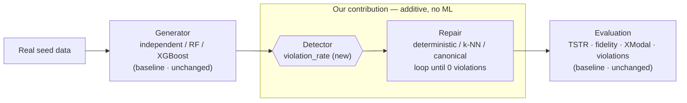

# Constraint Repair for Hierarchical Synthetic Tabular Data

**Disentangling logical validity from statistical utility in synthetic tabular data.**

**Authors:** Nandini Saxena · Snigdha Sarkar

This repository extends the framework from *Hierarchical Synthetic Tabular Data Generation: A Hybrid Top-Down and Bottom-Up Framework* (Junfeng Nie, Alvin Jin, Xiaohui Chen — USC / AnyFluxion) with a **constraint-repair layer** that detects and repairs logically impossible synthetic rows, and an experiment that separates *logical validity* from *statistical utility*.

- **Interactive showcase:** https://nandini1612.github.io/hierarchical-synthetic-tabular-data-generation/ (also deployable to Vercel — static site in `docs/`)
- **Baseline we build on:** https://github.com/junfengn-ctrl/hierarchical-synthetic-tabular

---

## The gap we close

The baseline paper states its top-down path enforces **two** things: cross-modal alignment **and** "structure-driven logical constraints." Reading the actual code, only cross-modal alignment is implemented and measured. **Row-internal logical consistency is named in the abstract but never built.** That is the gap this work fills.

The deeper point: **statistical fidelity ≠ logical validity.** Every existing metric evaluates columns individually or in aggregate — none checks whether a single row is internally coherent. So a generator can score well on downstream utility (TSTR AUROC) while emitting records that could never exist.

**Canonical example (Bank Marketing).** A row with `pdays = -1` ("never previously contacted"), `previous = 3` ("contacted 3 times before"), and `poutcome = success` ("a previous campaign succeeded"). Every field is individually plausible; together they are impossible. No baseline metric flags it.

## What we added

A **generator-agnostic detect-and-repair stage**, inserted between synthesis and evaluation. It is strictly additive — no existing code is modified — and does **no machine learning** (no training, no GPU, no learned parameters): just vectorized boolean checks, a similarity lookup, and a convergence loop.

1. **Detector / violation metric** — hand-written deterministic logical rules per dataset schema; each is a boolean test over columns. Produces a new `violation_rate` (overall and per-constraint).
2. **Repair — three strategies:**
   - **Deterministic** — when the correct value is exactly derivable from the row itself (e.g. `education → education_num` on Adult). Applied exactly.
   - **k-NN** — when the answer isn't unique, copy the offending columns from the most similar *real* record (nearest-neighbour projection). Minimally invasive, but borrows real data.
   - **Canonical** — fix the row using **only its own values** (an internally-consistent default). Reaches the same validity, injects no real data. This is the control that isolates validity from leakage.
3. **Convergence loop** — constraints share columns, so a fix can re-break another; the full sweep re-runs until no violations remain (converges in ≤3 passes).

### Architecture

The repair stage is inserted between synthesis and evaluation. It touches no baseline code, so it runs identically after any generator.



## Headline findings

Regenerated into `data/processed/repair_ablation_v2/` (2 benchmarks × 3 generators × 3 repair modes × 3 seeds).

- **Validity is solved.** Impossible rows drop to **exactly 0%** for every generator and repair mode (independent 40% → 0, RandomForest 11% → 0, XGBoost 13% → 0).
- **Repair is free and non-interfering on good generators.** On RandomForest / XGBoost, all three modes score identically within seed noise, and cross-modal alignment (`mean_cross_modal_abs_diff`) is byte-identical.
- **The apparent "utility boost" from repair is real-data leakage.** On the weak `independent` generator, k-NN repair lifts TSTR AUROC by +0.08…+0.12 — but **canonical repair, at the same 0% validity, does not** (it dips slightly, −0.01…−0.07). Same validity, opposite effect ⇒ the gain is k-NN copying real values in, not logical validity.
- **It's cheap.** On 12,000 rows, one laptop CPU: detection ≈ 7 ms, canonical repair ≈ 38 ms, k-NN repair ≈ 1.2 s (~1% of a real generator's runtime — RandomForest takes ~100 s to generate the same rows). Discarding invalid rows instead would throw away ~40% of a weak generator's output.

### The correction (why we trust the above)

An early Adult run using k-NN for a rule that is actually deterministic showed a large TSTR AUROC gain (+0.095). Investigation traced it to k-NN leaking a whole real neighbour's coherence. Making that repair exact (deterministic) erased the gain (+0.004). We then verified the same effect on Bank Marketing by adding the **canonical** arm — which is what turns "we suspect leakage" into "validity and utility move in opposite directions." The inflated result was withdrawn; the conservative claim stands.

### Honest thesis

> Logical validity and statistical utility are separable properties requiring separate mechanisms. Rule-conditioning (already in the baseline) drives utility; repair (this work) drives validity. Combining them costs nothing. Repair alone, even when maximally precise, does **not** reliably recover utility — any apparent gain is real-data leakage.

---

## New in this extension

| file | purpose |
| --- | --- |
| `src/constraint_repair.py` | core module: `Constraint` dataclass (`check`, `repair_cols`, optional `deterministic_fix` / `canonical_fix`), `compute_violation_report()`, `repair_dataframe(mode="knn"\|"canonical")`, `repair_csv()`, and the Bank Marketing constraint set |
| `src/adult_german_constraints.py` | Adult Income and German Credit constraint sets, with per-dataset confidence levels stated explicitly |
| `src/run_repair_ablation.py` | the rule-conditioning × repair-mode ablation runner; logs `violation_rate` alongside the baseline fidelity/utility metrics |
| `src/robustness_check.py` | generalisation check on Adult Income and German Credit |
| `docs/` | the interactive showcase site (`index.html`) and deep-dive guide (`guide.html`) |
| `data/processed/repair_ablation_v2/` | regenerated 3-arm ablation results |

### Run the constraint-repair ablation

```bash
python src/run_repair_ablation.py \
  --datasets weak_multimodal,weak_multimodal_gemini \
  --methods independent,random_forest,xgboost \
  --seeds 42,123,2024 \
  --n-rows 12000 \
  --output-dir data/processed/repair_ablation_v2
```

Outputs `repair_ablation_results.csv` (one row per dataset / method / repair_mode / seed) and `repair_ablation_summary.csv` (aggregated over seeds), each a superset of the baseline result schema plus `violation_rate_before`, `violation_rate_after`, and `repair_passes_run`.

---

## Setup

```bash
python -m pip install -r requirements.txt
```

Dependencies: `pandas`, `numpy`, `scikit-learn`, `xgboost`, `sdv`. CPU-only throughout.

## Data

Raw/processed datasets are not tracked by git. Place raw CSVs under `data/raw/`, then regenerate processed files with the pipeline.

| dataset | expected path | role |
| --- | --- | --- |
| Bank Marketing | `data/raw/bankmarketing.csv` | tabular source for weak-multimodal benchmarks |
| FinancialPhraseBank | `data/raw/FinancialPhraseBank.csv` | text source for weak-multimodal benchmarks |
| Adult Income | `data/raw/adultincome.csv` | tabular benchmark |
| German Credit | `data/raw/German_Credit_data.csv` | tabular benchmark |

Prepare the processed datasets:

```bash
python src/main.py prepare
```

## Reproduce everything

```bash
# 1. baseline experiments (independent / gaussian_copula / random_forest / xgboost)
python src/run_experiments.py --datasets weak_multimodal,weak_multimodal_gemini,adult_income,german_credit --methods independent,gaussian_copula,random_forest,xgboost --seeds 42,123,2024 --n-rows 12000 --output-dir data/processed/experiments

# 2. this work: constraint-repair ablation (none / knn / canonical)
python src/run_repair_ablation.py --datasets weak_multimodal,weak_multimodal_gemini --methods independent,random_forest,xgboost --seeds 42,123,2024 --n-rows 12000 --output-dir data/processed/repair_ablation_v2

# 3. robustness check on Adult Income and German Credit
python src/robustness_check.py
```

The baseline README's full workflow, evaluation protocol (TRTR/TSTR, fidelity, cross-modal), configuration, and benchmark details still apply and are documented in the deep-dive guide.

## The showcase site (`docs/`)

`docs/index.html` is a self-contained static page — no build step. It explains the gap, lets you **edit a row and watch it get validated and repaired**, **generate a synthetic batch in-browser and repair the whole thing**, and shows every result chart (validity → 0, the leakage demo, flat AUROC on strong generators, cost).

- **GitHub Pages:** Settings → Pages → Deploy from a branch → `main` / `/docs`.
- **Vercel:** Framework Preset `Other`, Root Directory `docs`, no build command.

## Limitations

- Constraints are hand-authored per schema; they don't auto-scale to new datasets.
- German Credit's constraint set is deliberately conservative (category/range checks only) due to uncertainty about the exact Statlog numeric codebook — a weaker robustness test than Adult or Bank Marketing.
- Repair has been tested downstream of tree-based / statistical generators (independent, RandomForest, XGBoost), not LLM-based autoregressive generators (GReaT / TabuLa) — flagged as the highest-value next test.

## Citation

This extension:

```bibtex
@misc{saxena_sarkar_constraint_repair,
  title  = {Constraint Repair for Hierarchical Synthetic Tabular Data:
            Disentangling Logical Validity from Statistical Utility},
  author = {Saxena, Nandini and Sarkar, Snigdha},
  note   = {Extension of Nie, Jin \& Chen (2026)},
  year   = {2026}
}
```

Baseline framework:

```bibtex
@inproceedings{nie2026hierarchical,
  title  = {Hierarchical Synthetic Tabular Data Generation: A Hybrid Top-Down and Bottom-Up Framework},
  author = {Nie, Junfeng and Jin, Alvin and Chen, Xiaohui},
  year   = {2026}
}
```

## Acknowledgements

We thank Junfeng Nie, Alvin Jin, and Xiaohui Chen for the open baseline framework this work extends. The baseline synthesis and evaluation code (`src/baseline_*.py`, `src/evaluate_*.py`, `src/run_experiments.py`, `src/main.py`, and the `configs/`) is theirs; the constraint-repair layer, the three-mode ablation, the robustness check, and the showcase site are our additions.

## License

Released under the MIT License. See [`LICENSE`](LICENSE).
